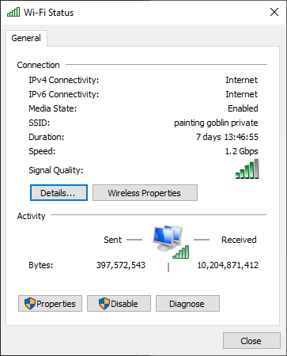
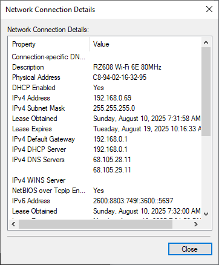

# View Wired and Wireless Nic Information 

## Question 1

What is the Service Set Identifier (SSID) for the wireless router of your connection?

Painting Goblin Private

## Question 2

What is the speed of your wireless connection?

1.2Gb/s

## Question 3

What is the MAC address of your wireless NIC?

c8-94-02-16-32-95

## Question 4

Do you have multiple IPv4 DNS Servers listed? If so, why would multiple DNS Servers be listed?

Yes, they are present for redundancy and reliability.

## Question 5

Why would you activate more than one NIC on a PC?

For redundancy and reliability purposes, as well as the ability to connect to two different networks simultaneously.