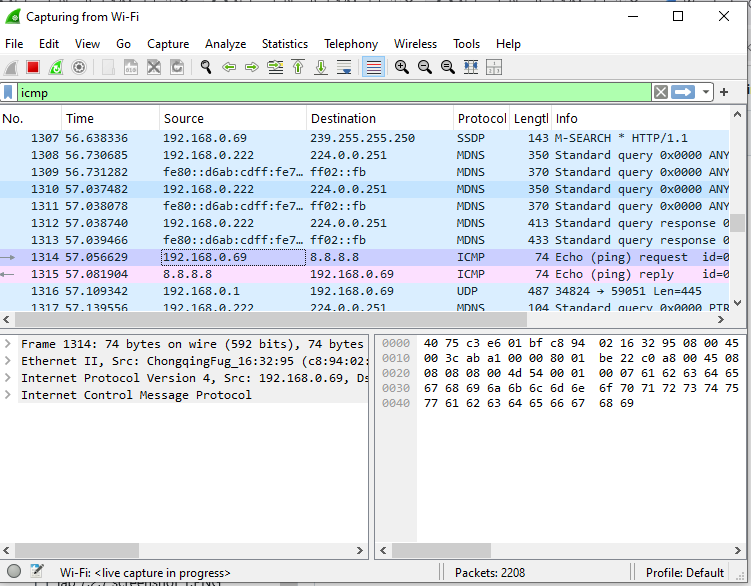
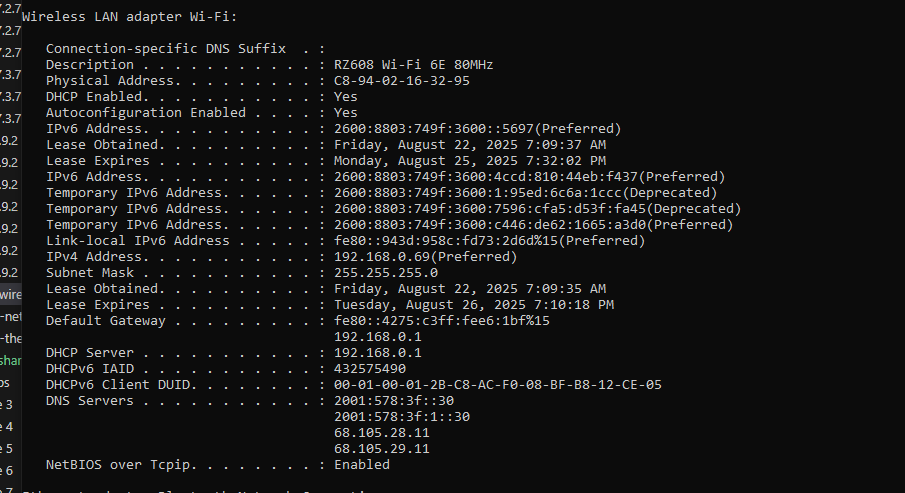

# 7.1.6 Lab - Use Wireshark to Examine Ethernet Frames

## Objectives

- **Part 1:** Examine the Header Fields in an Ethernet II Frame  
- **Part 2:** Use Wireshark to Capture and Analyze Ethernet Frames

---

## Part 1: Examine the Header Fields in an Ethernet II Frame

### Step 1: Review the Ethernet II header field descriptions and lengths

| Field               | Length         |
|--------------------|----------------|
| Preamble            | 8 Bytes        |
| Destination Address | 6 Bytes        |
| Source Address      | 6 Bytes        |
| Frame Type          | 2 Bytes        |
| Data                | 46–1500 Bytes  |
| FCS                 | 4 Bytes        |

---

### Step 2: Examine the network configuration of the PC

**Screenshot Placeholder:**  
`!ipconfig output`

---

### Step 3: Examine Ethernet frames in a Wireshark capture

**Screenshot:**  

### Step 4: Examine the Ethernet II header contents of an ARP request

1. **What is significant about the contents of the destination address field?**  
   _Answer: This tells network devices where a packet is going._  

2. **Why does the PC send out a broadcast ARP prior to sending the first ping request?**  
   _Answer: the pc does not know the mac address of the destination ip so it sends a broadcast arp request to find the mac address._  

3. **What is the MAC address of the source in the first frame?**  
   _Answer: c8:94:02:16:32:95_  

4. **What is the Vendor ID (OUI) of the Source NIC in the ARP reply?**  
   _Answer: c8:94:02_  

5. **What portion of the MAC address is the OUI?**  
   _Answer: the first three bytes_  

6. **What is the NIC serial number of the source?**  
   _Answer: 16:32:95_  

---

##